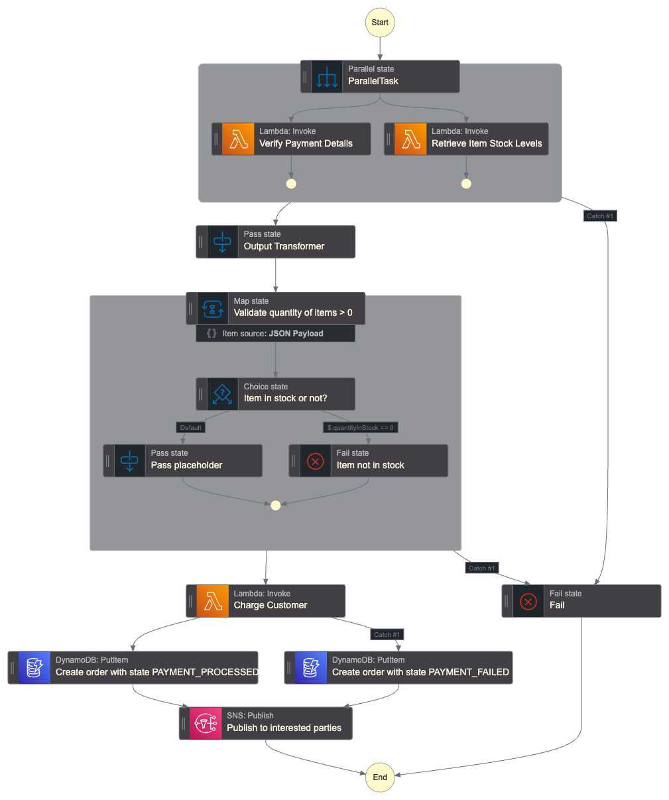

# Order Processing Workflow with AWS Step Functions using the AWS Cloud Development Kit
This repository contains an order processing workflow developed using AWS Step Functions. It is almost identical to another repo in my portfolio but I reimplemented it using the CDK as a learning exercise. 

The architecture is given below and the ASL code is contained in `workflow.asl.json`; the CDK code is written in Python and is in `order_processing_workflow_cdk_stack`. For specific details on the workflow and implementation using Step Functions Workflow Studio, see [here](https://github.com/d-lazenby/order-processing-workflow/tree/main).

